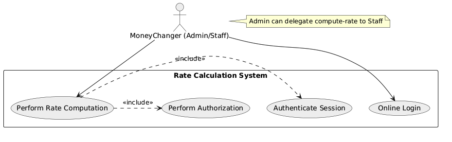
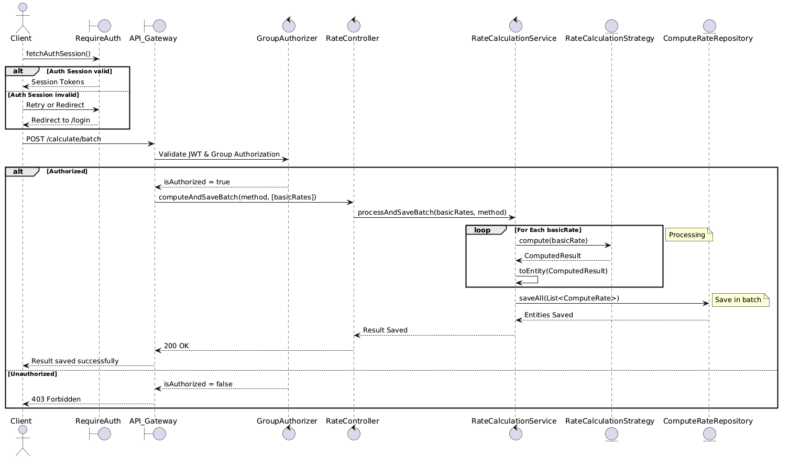
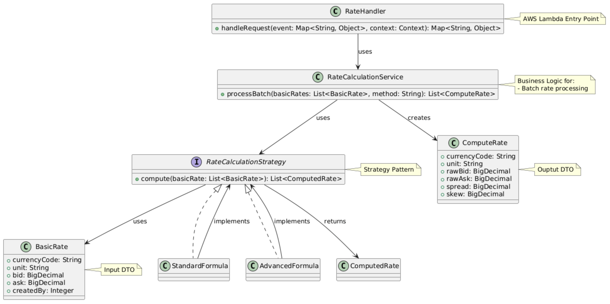
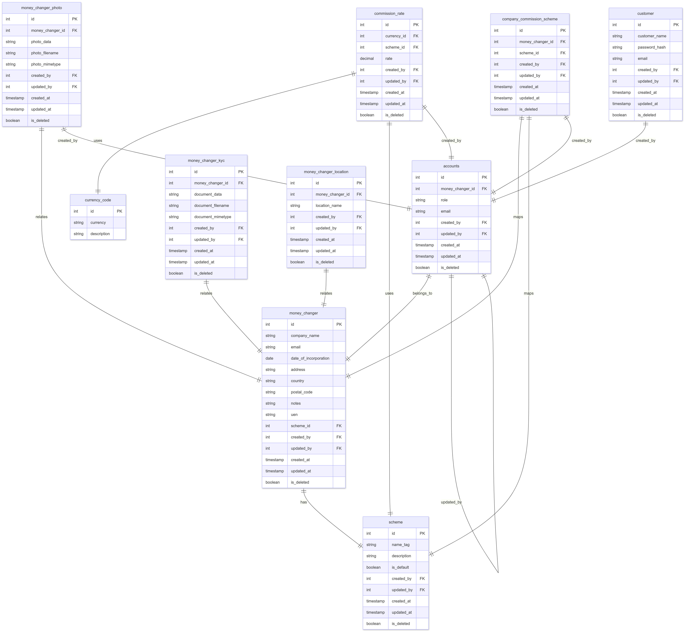
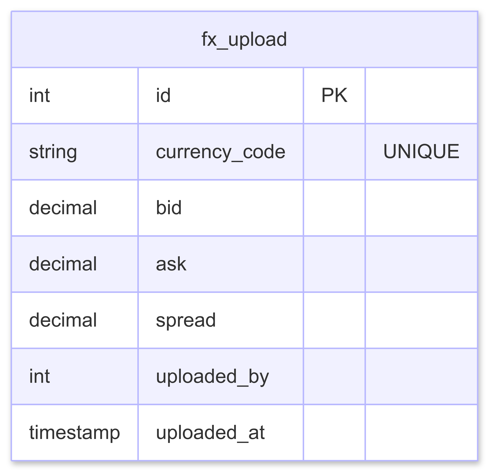
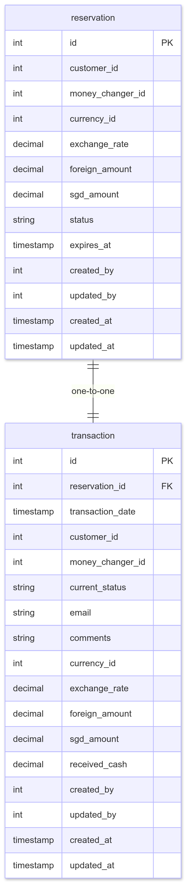
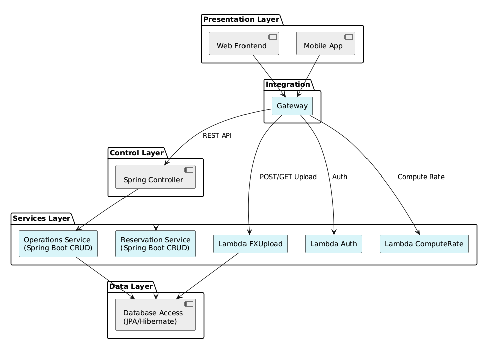

# 💱 MoneyChanger API

This is a production-ready backend service for managing money changers, featuring:

* Role-based logic (`admin` vs `staff`)
* Soft delete support
* REST API design
* MySQL-compatible schema (support AWS RDS)

---

## 🏗️ Setup Instructions

### 1. Requirements

* Java 21
* Maven
* MySQL (local or AWS RDS)


### 2. Database Setup

#### Provision MySQL 8.0 container for Docker.

Create the environment variables required for `docker-compose.yml`:

```
${MYSQL_ROOT_PASSWORD}
${MYSQL_DATABASE}
```
Run Docker Compose
```bash


docker-compose up -d
```
Run the SQL script located in `resources/dbscript` using the MySQL terminal to create the database and required tables:

```sql
01_db_creation.sql
02_moneychanger_schema.sql
03_fxupload_schema.sql
04_reservation_schema.sql
05_money_changer_test_data.sql
06_computeratedb_schema.sql
```

### 3. Application Properties

Create the environment variables required for `src/main/resources/application.yml` configuration:

```
${DB_URL}
${DB_USERNAME}
${DB_PASSWORD}
```

### 4. Run the Application

Use IntelliJ IDEA or run:

```bash


mvn spring-boot:run
```

## 📁 Project Structure

* `config/` – Configuration classes for application settings, beans, security, or data sources.
* `controller/` – Defines REST API endpoints and handles incoming HTTP requests.
* `dto/` – Data Transfer Objects used for request/response payloads between layers.
* `exception/` – Custom exception classes and global exception handling (e.g., @ControllerAdvice).
* `mapper/` – Maps between entities and DTOs, often using MapStruct or manual mapping logic.
* `model/` – JPA entity classes representing database tables.
* `repository/` – Spring Data JPA repositories for database access and queries.
* `service/` – Business logic layer that processes data and orchestrates repository interactions.
---

## ✅ Additional Notes

* `isDeleted` enables soft delete.
* `accounts.role` distinguishes admin and staff.
* Only admins can perform delete operations.
* `created_by`, `updated_by`, `created_at`, and `updated_at` support audit tracking.
 
---

## 📊 UML Diagrams

### Use Case Diagram for Compute Rate Processing




### Sequence Diagram for Compute Rate Use Case



### Class Diagram for Compute Rate



## 📊 Database Diagrams

### MoneyChanger Microservice ERD Diagram



### FxUpload Microservice ERD Diagram



### Reservation Microservice ERD Diagram



## 📊 Architecture Diagrams

### Overview Logical Architecture 

